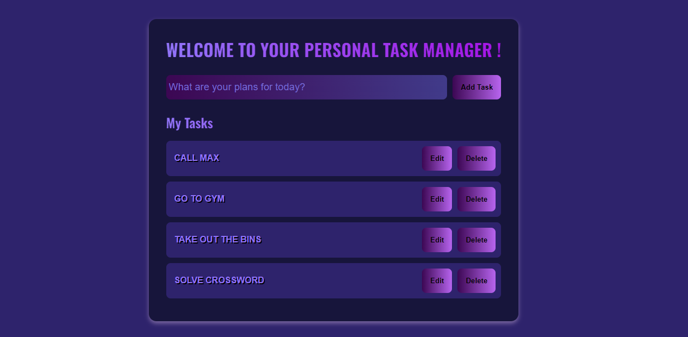

# To-Do List Task Manager

Welcome to your personal task manager! This project is a simple and responsive To-Do List application built using HTML, CSS, and JavaScript. 

## Features

- **Add Tasks**: Easily add new tasks to your to-do list.
- **Edit Tasks**: Modify existing tasks with a simple click.
- **Delete Tasks**: Remove tasks that are no longer needed.
- **Responsive Design**: Works seamlessly on both desktop and mobile devices.
- **User-friendly UI**: Simple and intuitive interface for managing your daily tasks.

## Demo



## Technologies Used

- HTML
- CSS
- JavaScript

## Installation

1. Clone the repository:

    ```sh
    git clone https://github.com/KhushiKhanal4/To-Do-List.git
    ```

2. Navigate to the project directory:

    ```sh
    cd To-Do-List
    ```

3. Open `index.html` in your web browser to see the application in action.

## Usage

1. **Adding a Task**: Type your task into the input field and click the "Add Task" button.
2. **Editing a Task**: Click the "Edit" button next to a task to enable editing. Once edited, click "Save" to save the changes.
3. **Deleting a Task**: Click the "Delete" button next to a task to remove it from the list.


## Contributing

Contributions are welcome! If you have suggestions for improvements or find any bugs, feel free to open an issue or submit a pull request.

## License

This project is licensed under the MIT License - see the [LICENSE](LICENSE) file for details.

## Contact

If you have any questions or feedback, feel free to reach out:

**GitHub**: KhushiKhanal4
**Email**: khanalkhushi123@gmail.com

## Project Structure

```plaintext
To-Do-List-Task-Manager/
├── index.html
├── style.css
└── script.js